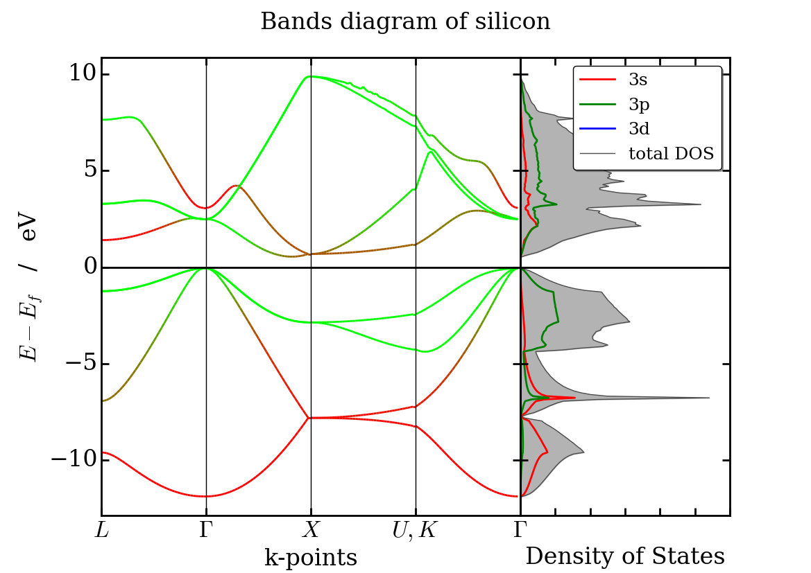

# Band Structure Plots

Band structure plots from VASP calculations using pymatgen and a rgb scale to
look at atomic or orbital contributions.

## Examples

The reported examples are done using python3 and pymatgen version 3.4.0.

* copper : Cu_bands/
* silicon : Si_bands/
* graphene : graphene/

> The accuracy of band structures presented here was not the aim of these
> calculations. The results were used in order to show the results of the
> scripts.
> You have to do your own calculations depending on what you are looking for.

## More examples :

* [Silicon band structure with plotly](http://nbviewer.jupyter.org/github/gvallverdu/cookbook/blob/master/plotly_bandDiagram.ipynb)
* [MnO band structure with plotly](http://nbviewer.jupyter.org/github/gvallverdu/cookbook/blob/master/plotly_bandDiagram_SpinPolarized.ipynb)
